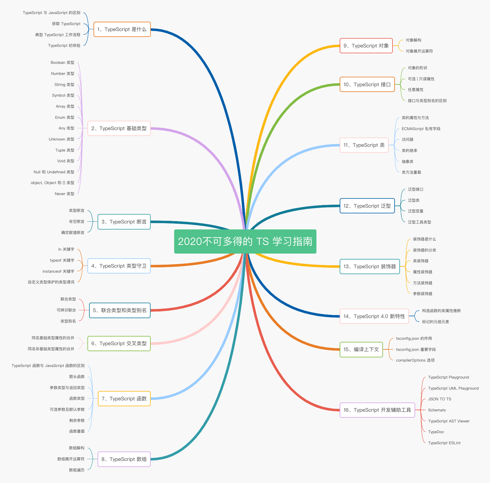

# TypeScript

> 向JS添加可选的静态类型和基于类的面向对象编程

- [官网](https://www.typescriptlang.org/)
- [一份不可多得的 TS 学习指南（1.8W字）](https://juejin.im/post/6872111128135073806?utm_source=gold_browser_extension)
- [类型即正义：TypeScript 从入门到实践系列](https://juejin.im/post/6844904167840940039)
- [官网在线测试练习](https://www.typescriptlang.org/play?#code/FAAhQ)

